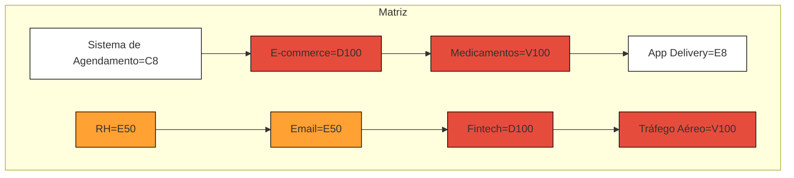

# GAPS_Crystal
# Exercício 1

1. O ar-condicionado de um escritório parou de funcionar em um dia quente.
   C-20. Não é algo que vai matar vidas, mas vai ser desconfortável e pode prejudicar o rendimento dos funcionários
2. O sistema de pagamento online de um banco ficou fora do ar por 3 horas
   D-50. Prejuízo pro banco
3. Um hospital perdeu energia elétrica e o gerador não ligou
   V-100. Estamos falando de vidas
4. Um aplicativo de transporte apresenta falha no cálculo das tarifas
   E-50. Pode atrasar o pagamento da tarifa, e pode atrasar o transporte público 
5. Uma falha na rede elétrica deixou um bairro inteiro sem luz por 6 horas
    E-100. Sem eletricidade o bairro fica incapacitado de fazer qualquer coisa que envolva eletrecidade  
6. Um site de e-commerce teve vazamento de dados de clientes.
    V-50. Vazamento de dados vale vidas, dinheiro e entre outras coisas  
7. O elevador de um prédio comercial parou com pessoas dentro
    V-50. Risco de vida, pois pode ter a chance de o elevador cair
8. O sistema de iluminação pública de uma cidade apagou durante a noite   
    E-100. É o mínimo que se deve ter durante a noite.
# Exercício 2

1. O sistema de agendamento interno de uma empresa apresenta lentidão, mas ainda funciona.

2. A plataforma de e-commerce ficou fora do ar durante a Black Friday

3. Um sistema hospititalar de prescrição de medicamentos apresentou galha e não mostra dosagens corretas

4. O aplicativo de delivery não atualiza o status dos pedidos em tempo real

5. Um banco de dados de RH perdeu registros de ponto eletrônico de 1 semana

6. O servidor de e-mail corporativo caiu por 2 horas em uma empresa multinacional

7. Uma falha de segurança expôs dados sensíveis de clientes de uma fintech

8. Um sistema de controle de tráfego aéreo apresentou falhas intermitentes.

